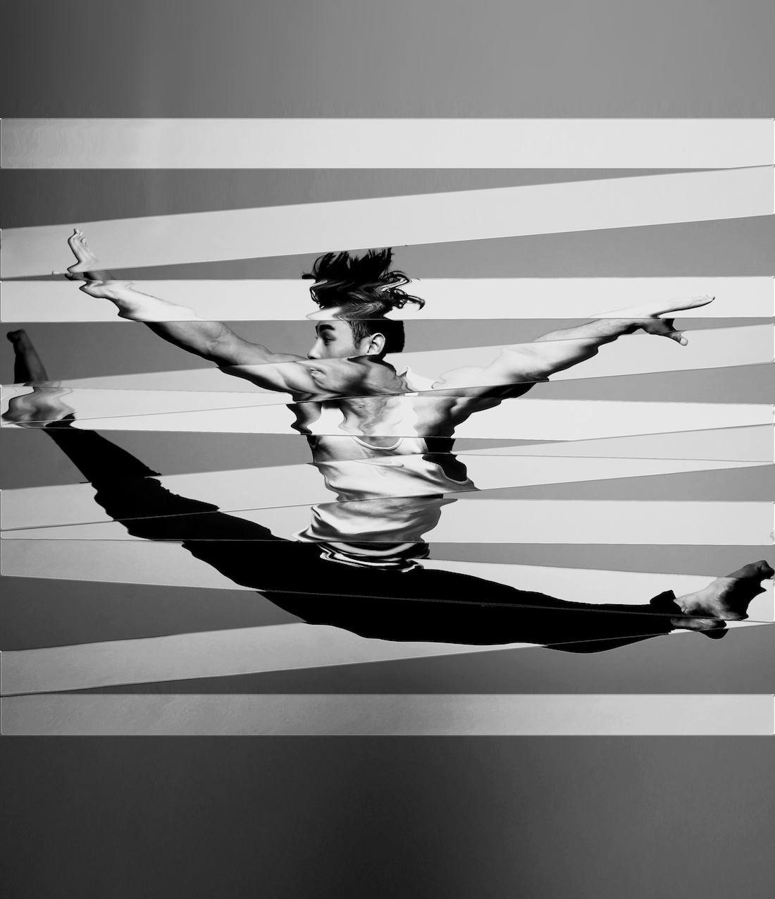
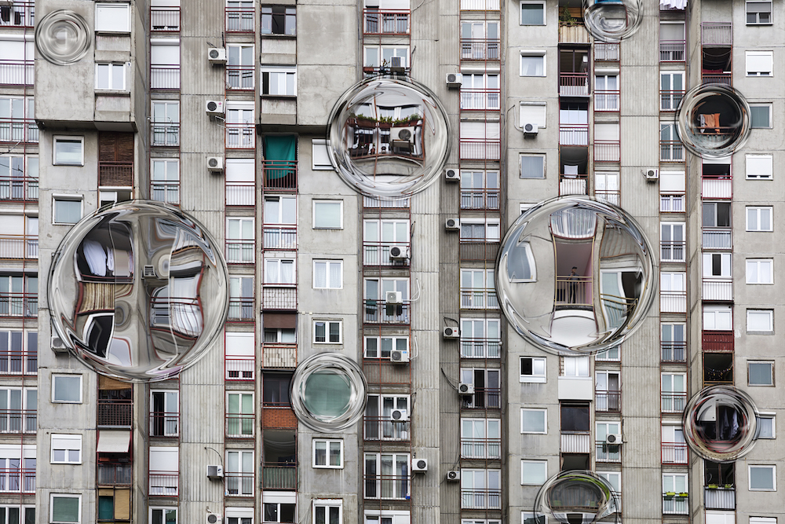

# The Looking Glass Effect
October 17, 2018

Images created (in order from left to right) by Nicolle Rodriguez and Joel Robison

Sometimes it’s fun to pick up on different techniques that other artists are using. Often enough, we get caught up in the habitual cycle of how we’re used to doing things and we forget to explore the vast depths of creativity.  I think it’s important to build community so that we can inspire one another and look at things through fresh eyes. With that being said, here’s a quick look at a Photoshop technique featured on the Adobe Create magazine.

The idea is to create a “looking glass” effect that lays on top of images. It’s a quick and fun way to make photographs more interesting. The effect gives the photographs a unique and transcendent look. Lucky for you, Adobe was kind enough to share this Photoshop action set with the world. Below I have provided a link that will direct you to a free download of this action set. Feel free to try it out for yourself! I would love to see your guys's results, so leave your pictures in the comments! The link displayed below will also direct you to the credited arts pictured above as well as a video tutorial on how to use the action set.

https://create.adobe.com/2018/5/24/free_photoshop_actio.html

### My Attempts
Here are some of my pieces I used Campau’s action set on. Try it out and tell me what you think! Do you like this “looking glass” effect? Do you think it was helpful or harmful to your photography? Was it easy to use? Let me know in the comments!

